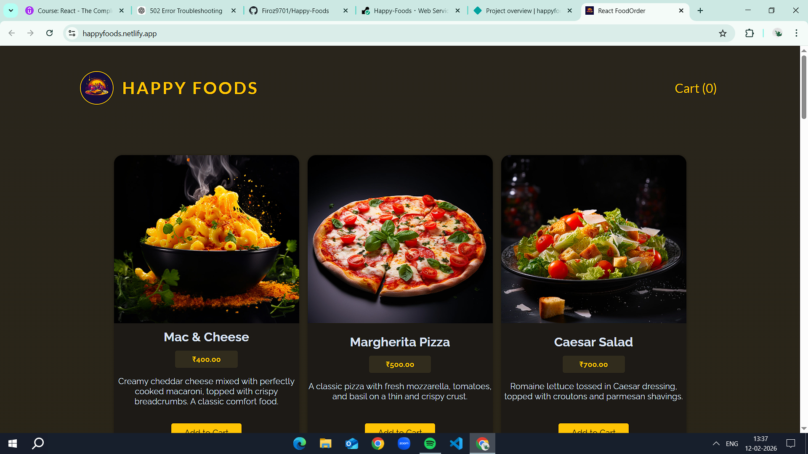

# 🍔 Happy Foods – Food Order App

A full-stack food ordering application built with React and Express.

## 🚀 Live Demo

Frontend (Netlify):
https://happyfoods.netlify.app

Backend (Render):
https://happy-foods.onrender.com

---

## 📸 Project Preview



---

## 🛠 Tech Stack

### Frontend
- React
- Vite
- Axios
- Custom Hooks

### Backend
- Node.js
- Express
- File System (JSON storage)

### Deployment
- Netlify (Frontend)
- Render (Backend)

---

## ✨ Features

- View available meals
- Add items to cart
- Submit order
- Form validation
- Error handling
- Loading states

---

## 🧠 What I Learned

- Deploying React apps on Netlify
- Deploying Express backend on Render
- Connecting frontend & backend in production
- Handling CORS
- Debugging 502 & 404 errors

---

## 📦 Installation (Local Setup)

### 1️⃣ Clone the repository

```bash
git clone https://github.com/your-username/food-order-app.git

2️⃣ Install dependencies
**Frontend:**
npm install

**Backend:**
cd backend
npm install

3️⃣ Run locally

**Backend:**

node app.js

**Frontend:**

npm run dev

👨‍💻 Author

Firoz Khan


---

# ✅ Step 3 — Push to GitHub

```bash
git add README.md preview.png
git commit -m "Added README with preview"
git push


